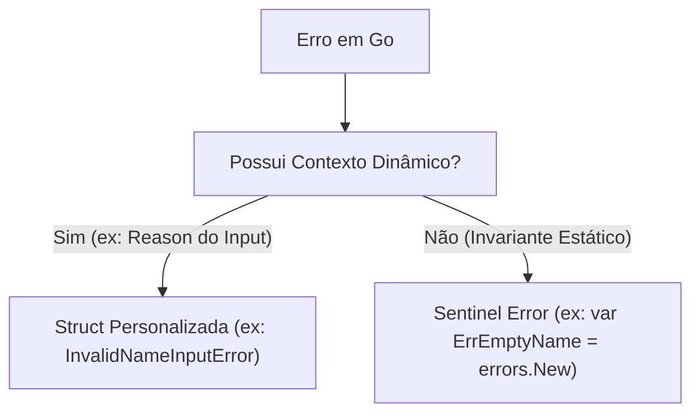
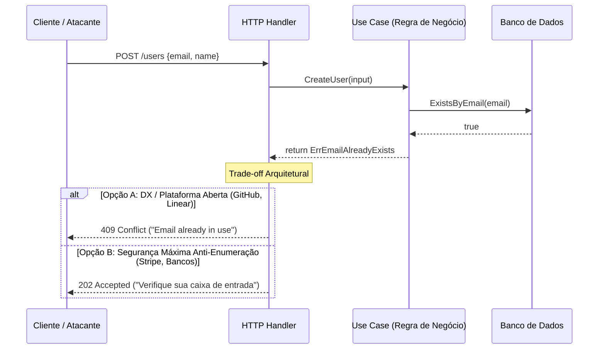

# 📘 Playbook de Engenharia de Software: Domínio, Go Idiomático e Segurança Defensiva

Este documento consolida os princípios de arquitetura, padrões de design em Go, regras de domínio (DDD) e práticas de segurança defensiva (*Secure by Design*) debatidos e aplicados durante o desenvolvimento do backend quântico.

---

## 1. Modelagem de Domínio & *Secure by Design*

### 1.1 Domain Primitives vs. Primitive Obsession
* **Anti-pattern (*Primitive Obsession*):** Utilizar tipos primitivos puros (`string`, `int`) diretamente em entidades e casos de uso, espalhando validações repetitivas e permitindo que dados inválidos transitem pelo sistema.
* **Solução (*Domain Primitive*):** Encapsular a primitiva em uma `struct` com campo não exportado (privado):
  ```go
  type Name struct {
      value string // privado: impede instanciação direta de fora do pacote
  }
  ```
* **Por que não usar `type Name string`?**
  Em Go, `type Name string` permite conversão de tipo direta (`Name("invalido")`) em qualquer pacote sem passar pelo construtor [`NewName`](file:///home/bruno/qml-pennylane-project/internal/domain/user/name.go#L19). A `struct` com campo privado torna **estados ilegais irrepresentáveis por construção** (*Secure by Design*, Caps. 3 e 4).

### 1.2 Value Objects Abertos vs. Enums Fechados
* **Tipos Abertos (ex.: `Name`, `Email`):** Possuem espaço amostral infinito. Devem ser `struct` com construtor validador e métodos imutáveis (`String()`).
* **Enums Finitos (ex.: `Role`):** Possuem conjunto fechado e conhecido de valores.
  * Em Go, devem ser modelados como `type Role string` acompanhados de `const` de compilação.
  * **Risco de Segurança:** Tentar modelar enums como structs obriga o uso de variáveis globais (`var`), permitindo mutação acidental ou maliciosa em tempo de execução via ponteiros ou concorrência.

### 1.3 Invariantes de Entidade e Zero-Values
* Em Go, toda `struct` possui um *zero value* (`Name{}` tem `value == ""`).
* **Regra de Agregado:** A entidade raiz (ex.: [`User`](file:///home/bruno/qml-pennylane-project/internal/domain/user/user.go#L7)) nunca deve aceitar instâncias vazias/não inicializadas.
* O construtor [`NewUser`](file:///home/bruno/qml-pennylane-project/internal/domain/user/user.go#L14) deve retornar `(*User, error)` para garantir que uma entidade corrompida jamais exista em memória.

### 1.4 `IsValid()` vs. `IsZero()` e Linguagem Ubíqua
* `IsZero()` verifica se os bytes na memória são todos zero.
* `IsValid()` expressa **Regra de Negócio** na Linguagem Ubíqua (*Ubiquitous Language*).
* No domínio científico/quântico, um valor zero (como rotação de 0 radianos) pode ser perfeitamente legal na física. O método `IsValid() bool` garante que a semântica de integridade de negócio seja preservada e consistente em todo o repositório.

---

## 2. Reconstituição de Entidades (*Persistence Hydration*)

Em Clean Architecture e DDD, a entidade possui dois ciclos de vida distintos:

| Ciclo | Função | Responsabilidade | Quem Chama? |
| :--- | :--- | :--- | :--- |
| **Criação Nova** | [`NewUser`](file:///home/bruno/qml-pennylane-project/internal/domain/user/user.go#L14) | Gera novo UUID (`uuid.New()`), fixa papel inicial padrão (`RoleUser`) e valida invariantes. | Caso de Uso (`UserService.CreateUser`) |
| **Reconstituição** | [`RestoreUser`](file:///home/bruno/qml-pennylane-project/internal/domain/user/user.go#L31) | Não gera novo ID; reconstrói a entidade a partir das colunas lidas do banco (`sqlc`/Postgres). | Adaptador de Repositório (`UserRepository`) |

> **Regra de Ouro:** Clientes HTTP **nunca** devem enviar o seu próprio ID na criação de entidades. Isso previne vulnerabilidades de *ID Spoofing*, colisão forçada e sobrescrita não autorizada.

---

## 3. Caracteres, Unicode e Resiliência a DoS (*Resource Exhaustion*)

### 3.1 Bytes vs. Runas em Go
* `len(str)` conta o número de **bytes** UTF-8 (`len("José") == 5`).
* `utf8.RuneCountInString(str)` conta o número de **caracteres humanos / runas** (`RuneCountInString("José") == 4`).
* Limites de tamanho de regras de negócio devem sempre ser aplicados sobre a contagem de runas.

### 3.2 Complexidade Algorítmica e *Fast Fail*
* `utf8.RuneCountInString` executa em complexidade $O(N)$ em relação ao tamanho em bytes da string.
* **Fast-Fail Guard:** Checar o comprimento máximo antes de disparar operações pesadas de alocação (`strings.ToLower`, `strings.TrimSpace`, parsers de e-mail ou regex):
  * Em payloads abusivos (10 MB), a guarda de tamanho rejeita a entrada em nanossegundos, impedindo picos de CPU e exaustão de memória da goroutine (*Secure by Design*, Cap. 8.2).

### 3.3 Validação de Nomes Internacionais
* Evitar regex de padrão ocidental (`^[a-zA-Z]+$`).
* O uso de `unicode.IsLetter(r)` permite suporte universal a alfabetos (latino, cirílico, mandarim, árabe, acentos) sem abrir brechas.
* **Invariante Humana:** Um nome deve conter pelo menos uma letra (`hasLetter`), impedindo entradas contendo apenas pontuação (como `"- - -"`).

### 3.4 Conformidade de E-mails (RFC 5321 / RFC 5322)
* Tamanho máximo total: **254 octetos** (RFC 5321 §4.5.3.1.3 e RFC 3696 Errata).
* Tamanho máximo da parte local: **64 octetos** (RFC 5321 §4.5.3.1.1).
* Ordem de validação:
  1. Guarda de comprimento total ($\le 254$).
  2. Parser estrutural formal da standard library (`mail.ParseAddress`).
  3. Verificação do tamanho da parte local ($\le 64$) e rejeição de display names (`addr.Name == ""`).

---

## 4. Design de Erros em Go 1.13+ (*Errors as Values*)

O modelo híbrido adotado no projeto representa a convenção idiomática de alta performance:



### 4.1 Quando usar Sentinel Errors vs. Structs de Erro?
1. **Sentinel Errors (`var Err... = errors.New(...)`):**
   * Usados quando o chamador só precisa verificar a **identidade** do erro (`errors.Is(err, target)`).
   * Não alocam memória adicional em cada ocorrência e mantêm a API enxuta.
2. **Struct Types (`type ... struct { Reason string }`):**
   * Usados quando o erro carrega dados adicionais que precisam ser inspecionados ou serializados para o cliente (ex.: detalhe do campo inválido).
   * Permitem extração via `errors.As(err, &target)`.

### 4.2 A Questão da Mutabilidade de Variáveis de Pacote (`var`)
* Em Go, variáveis exportadas no nível de pacote com `var` são tecnicamente mutáveis em tempo de execução por código dentro do mesmo binário.
* A standard library aceita esse trade-off pragmaticamente (`io.EOF`, `sql.ErrNoRows`, `context.Canceled`).
* **Alternativa de Imunidade Absoluta (*Constant Errors*):**
  Definir um tipo customizado sobre string e declará-lo como `const`:
  ```go
  type DomainError string
  func (e DomainError) Error() string { return string(e) }
  const ErrEmptyName = DomainError("user: name cannot be empty")
  ```
  O compilador do Go proíbe qualquer reatribuição a constantes, tornando o erro 100% imutável.

---

## 5. Filosofia de Interfaces em Go (*Effective Go*)

* **"Don't design with interfaces, discover them."**
* **"Accept interfaces, return structs."**
* **Interfaces pertencem ao Consumidor:** Em Go, quem define a interface é o pacote que consome a dependência (ex.: o `UserService` define a interface `UserRepository`), e não quem a produz.
* **Evitar Poluição de Interfaces (*Interface Pollution*):** Entidades de domínio ([`User`](file:///home/bruno/qml-pennylane-project/internal/domain/user/user.go#L7)) e funções construtoras ([`NewUser`](file:///home/bruno/qml-pennylane-project/internal/domain/user/user.go#L14)) não devem ter interfaces artificiais (`IUser`/`UserImpl`).

---

## 6. Segurança de APIs: Enumeração de Contas vs. DX

Ao tentar registrar um e-mail já existente na rota de cadastro:



### 6.1 Separação de Responsabilidades
* O **Use Case** deve ser estritamente honesto e reportar `ErrEmailAlreadyExists`.
* O **HTTP Handler** ou Gateway decide como responder ao cliente público conforme o modelo de ameaça (*Threat Model*).

### 6.2 O Trade-off no Mercado
* **SaaS para Desenvolvedores / B2B:** Adota `409 Conflict` ([RFC 9110 §15.5.10](https://www.rfc-editor.org/rfc/rfc9110#section-15.5.10)) priorizando clareza de UX, mitigando ataques de enumeração massiva através de **Rate Limiting por IP** e proteção no API Gateway / Cloudflare.
* **Sistemas de Alta Segurança:** Adotam fluxo assíncrono neutro (`202 Accepted`), enviando um e-mail de alerta em segundo plano para neutralizar vetores de enumeração (OWASP WSTG-IDNT-04).

---

## 7. Tratamento Global de Erros & Sanitização (CWE-209 / OWASP)

### 7.1 O Risco de Exposição de Informações Internas (CWE-209)
* **Falha Crítica:** Repassar erros de banco crus para a resposta HTTP (`pq: connection refused at postgres:5432`). Um atacante descobre a topologia interna da rede, portas, tabelas e versão do banco.
* **Princípio da Dissociação:** A resposta enviada ao cliente público e o registro no log interno do servidor devem ser totalmente independentes:

```mermaid
flowchart TD
    Err[Erro no UseCase / Repo] --> Handler[Global Error Handler / Middleware]

    subgraph Log Interno (Privado)
        Handler --> Log["slog.Error (Log Estruturado)"]
        Log --> Details["Stack Trace + Query SQL + Causa Raiz + RequestID"]
    end

    subgraph Resposta Pública (Cliente)
        Handler --> Check{Erro de Domínio?}
        Check -- Sim (4xx) --> Resp4xx["JSON Amigável: 'invalid email format'"]
        Check -- Não / Técnico (500) --> Resp500["JSON Opaco: 'internal server error' + RequestID"]
    end
```

### 7.2 Observabilidade via Correlation ID (`Request ID`)
* Para erros técnicos (HTTP 500), a API retorna apenas uma mensagem opaca acompanhada de um identificador único de rastreio (`request_id`).
* O desenvolvedor consulta o `request_id` nas ferramentas de monitoramento (Datadog, CloudWatch, Sentry) e visualiza o stack trace completo e as variáveis de ambiente sem expor nenhum detalhe sensível ao usuário.

---

## 8. Test Doubles & Resiliência a Falhas no Testkit (Martin Fowler)

### 8.1 Fake vs. Mock / Stub
* **Fake:** Implementação funcional simplificada em memória (ex: repositório com `map[uuid.UUID]*user.User`). Excelente para testar fluxos felizes (*Happy Path*).
* **Mock / Stub Configurável:** Dublê capaz de simular anomalias sob demanda (*"neste teste, falhe a persistência com timeout"*).

### 8.2 O Padrão de Campos de Erro (*Error Fields* - KISS)
Em vez de frameworks pesados de reflexão ou closures verbosas, adicionar campos de erro opcionais diretamente na struct do Mock:
```go
type MockUserRepository struct {
    users   map[uuid.UUID]*user.User
    SaveErr error // Se preenchido no teste, Save() retorna esse erro
}

func (r *MockUserRepository) Save(u *user.User) error {
    if r.SaveErr != nil {
        return r.SaveErr
    }
    r.users[u.ID()] = u
    return nil
}
```
* **Por que testar falhas de repositório no Use Case?** Para garantir que o caso de uso aborta imediatamente em caso de falha de I/O, não retorna saídas inválidas e elimina "código morto" na suíte de testes.

---

## 9. Árvore de Erros em Go 1.13+ e o Funcionamento de `%w`

### 9.1 Por que `assert.IsType` falha em Erros Envelopados?
* Ao usar `fmt.Errorf("...: %w", err)`, o Go envolve o erro original dentro de uma struct interna chamada `fmt.wrapError`.
* A função `assert.IsType` verifica **apenas o tipo da casca externa**. Por isso, comparar contra structs originais falha com `"expected SaveUserError, but was *fmt.wrapError"`.
* **Solução:** Utilizar `assert.ErrorIs` ou `assert.ErrorAs`, que invocam recursivamente o método `Unwrap()` da cadeia de erros.

### 9.2 Onde usar e onde NÃO usar `%w`
* **Erros de Domínio (`NewName`, `NewEmail`):** Retorne **diretamente sem `%w`** (`return nil, err`). O erro de domínio já é autoexplicativo e não precisa de prefixos de contexto adicionais.
* **Erros de I/O e Repositório:** **Use `%w`** (`fmt.Errorf("userusecase: save user: %w", err)`). Adiciona o contexto de qual etapa de negócio falhou, preservando a causa raiz técnica.

### 9.3 Implementação Robusta do Método `Is(target error) bool`
Para permitir que structs ricas com dados dinâmicos (`InvalidNameError{Reason: ...}`) sejam testadas com `assert.ErrorIs(t, err, user.ErrInvalidName)`:
```go
func (e *InvalidNameError) Is(target error) bool {
    if target == ErrInvalidName {
        return true
    }
    _, ok := target.(*InvalidNameError)
    return ok
}
```
* **Por que você NÃO precisa implementar o método `As`?** O `errors.As(err, &target)` funciona nativamente via reflexão de tipos do runtime do Go, encontrando e atribuindo structs compatíveis ao longo da árvore de `Unwrap()`.

---

## 10. Auditoria, RBAC e Semântica de Autorização (RFC 9110 / OWASP)

### 10.1 401 Unauthorized vs. 403 Forbidden
* **401 Unauthorized:** Falta de **Autenticação** (*"Não sei quem você é"* — ausência de token, sessão expirada).
* **403 Forbidden / Permission Denied:** Falta de **Autorização** (*"Sei quem você é, mas você não tem permissão para esta ação"*).
* Erros de papéis de usuários (RBAC) onde o `caller` já está autenticado devem sempre mapear para **403 Forbidden** ([`PermissionDeniedError`](file:///home/bruno/qml-pennylane-project/internal/usecase/userusecase/errors.go#L16)).

### 10.2 Contexto de Auditoria via `Reason()` e `CallerID`
* O método `Error()` expõe a mensagem limpa e padronizada.
* O método `Reason()` armazena a regra de negócio violada (`"owner cannot assign owner role"`), permitindo que o logger estruturado (`log/slog`) registre o evento sem expor regras internas para o cliente.
* **Uso de `CallerID`:** Logs forenses de auditoria devem sempre priorizar o UUID imutável do ator em vez de apenas nomes ou e-mails que configuram dados pessoais (PII) e podem ser alterados.

---

## 11. Idempotência em Operações de Atualização (RFC 9110 §9.2.2)

### 11.1 O Princípio da Idempotência em APIs
* Atualizações de estado via `PUT` ou `PATCH` devem ser tolerantes a retries de rede.
* Reenviar o mesmo papel ou os mesmos dados em caso de oscilação de conexão não deve gerar erro para o cliente.

### 11.2 Otimização de I/O de Banco de Dados (*No-Op*)
* Se o recurso já possui o estado solicitado (`target.Role() == role`):
  * **Não execute `Save` no banco!** 
  * Retorne `nil` imediatamente (*early return*), evitando escrita em disco de WAL no PostgreSQL, locks de linha desnecessários e disparo inútil de triggers de atualização.

### 11.3 A Regra Inegociável da Autorização
> **A autorização deve ser SEMPRE avaliada ANTES de qualquer atalho de idempotência.**
* Um usuário desprovido de privilégios (`RoleUser`) que tente invocar uma ação administrativa (mesmo que mantendo o mesmo papel) **deve receber 403 Forbidden**. Ignorar a checagem daria a falsa impressão de que o usuário tem acesso à capacidade administrativa.
* **Proteção do Papel `Owner`:** O papel de Owner não pode ser manipulado por endpoints comuns de alteração de papel; sua transferência atômica é de responsabilidade exclusiva do use case dedicado [`ChangeOwner`](file:///home/bruno/qml-pennylane-project/internal/usecase/userusecase/change_owner.go#L14).

---

## 12. Inversão de Dependência, Ciclos (DAG) e o Lugar dos Repositórios em DDD

### 12.1 A Proibição de Ciclos de Importação em Go
* O compilador do Go exige estritamente que as dependências formem um **DAG (*Directed Acyclic Graph*)**.
* Ciclos do tipo `A -> B -> A` (ex: `userusecase -> testkit -> userusecase`) impedem a compilação do projeto.

### 12.2 Por que `ErrNotFound` pertence ao Domínio (Eric Evans)?
* O Repositório em Domain-Driven Design (DDD) é uma **abstração conceitual do próprio Domínio**, representando o conjunto de todos os agregados em memória.
* Dizer que um usuário não existe **não é um detalhe de banco de dados** (PostgreSQL/SQL). É uma **Regra de Negócio do Domínio**: *"No universo deste sistema, não existe nenhuma entidade com essa identidade"*.
* Declarar `ErrNotFound` dentro de [`internal/domain/user/errors.go`](file:///home/bruno/qml-pennylane-project/internal/domain/user/errors.go) é a solução formal que:
  1. Quebra o ciclo de importação de forma matematicamente limpa.
  2. Evita a criação de micro-pacotes artificiais desnecessários (*Package Pollution*).
  3. Previne o **acoplamento horizontal entre Use Cases irmãos** (permitindo que `experimentusecase`, `vqcconfigusecase` e `trainconfigusecase` consultem a existência de usuários sem precisarem importar o `userusecase`).
